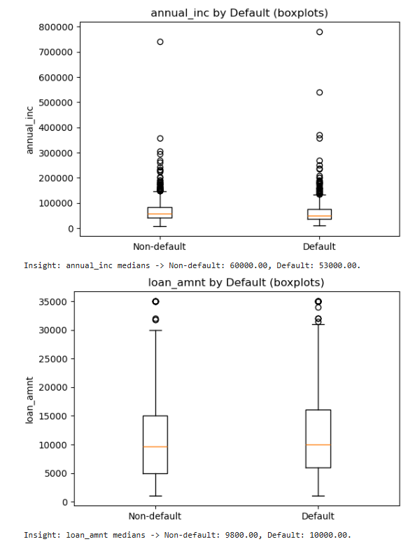
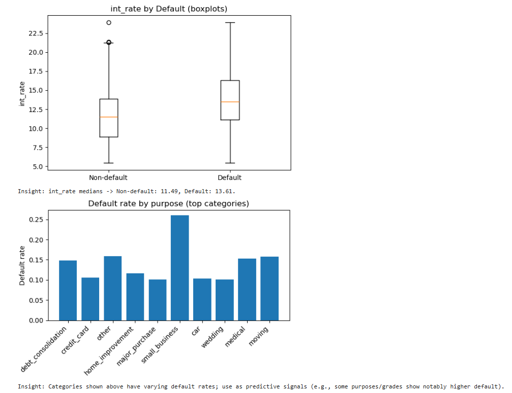
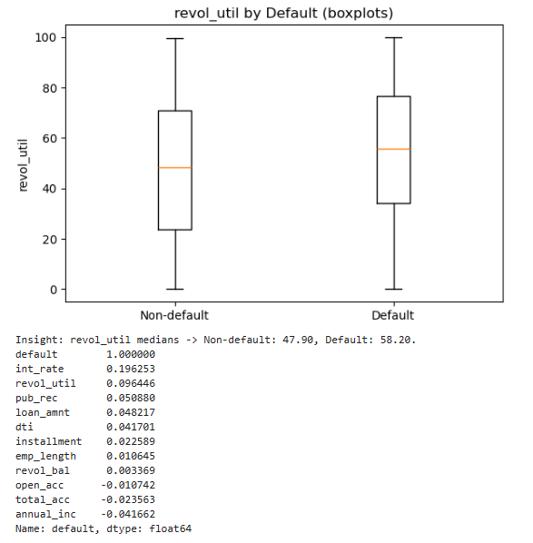

# 💳 LendingClub Loan Default Prediction

## 📘 Introduction
This project focuses on predicting the likelihood of loan default using LendingClub data. By analyzing borrower profiles, loan attributes, and financial indicators, the goal is to help financial institutions assess credit risk more effectively.  
The project demonstrates an end-to-end machine learning workflow — from data exploration and cleaning to model training and evaluation.

---

## 🎯 Objectives
- Predict the probability of a borrower defaulting on a loan.  
- Identify key factors influencing loan repayment behavior.  
- Build an interpretable model to assist in credit risk assessment.

---

## 🧠 Key Methods
- **Exploratory Data Analysis (EDA):** Conducted univariate and bivariate analysis to identify key trends.  
- **Feature Engineering:** Managed missing values, encoded categorical variables, and derived impactful features.  
- **Modeling:** Implemented Logistic Regression, Random Forest, and Gradient Boosting models.  
- **Evaluation Metrics:** Compared models using Accuracy, ROC-AUC, Precision-Recall, and Confusion Matrix.

---

## 📊 Visualizations

### 🔹 Bivariate Analysis

#### Bivariate Analysis 1  
  
*Relationship between interest rate and loan status.*

#### Bivariate Analysis 2  
  
*Loan amount vs. grade distribution.*

#### Bivariate Analysis 3  
  
*Debt-to-income ratio impact on default rates.*

#### Bivariate Analysis 4  
  
*Employment length and its correlation with loan default.*

---

### 🔹 Model Comparison
  
*Comparison of model performance before and after hyperparameter tuning.*

---

### 🔹 Feature Importance
  
*Top features contributing most to loan default prediction.*


## 🔍 Key Insights & Outcomes
- Borrowers with **higher interest rates** and **lower annual incomes** have increased default risk.  
- **Loan grade**, **purpose**, and **debt-to-income ratio** are major predictors of repayment behavior.  
- The **tuned Random Forest model** achieved the best performance with strong ROC-AUC results.  
- Insights derived can support **risk-based loan pricing** and **credit decision automation**.

---

## 🛠️ Technologies Used
- **Languages:** Python  
- **Libraries:** pandas, numpy, matplotlib, seaborn, scikit-learn, imbalanced-learn  
- **Environment:** Jupyter Notebook  

---

## ⚙️ Setup & Installation
**1. Clone the repository:**
   ```bash
   git clone https://github.com/yourusername/LendingClub-Loan-Default-Prediction.git
   cd LendingClub-Loan-Default-Prediction
   ```
**2. Install dependencies:**
   ```
   pip install -r requirements.txt
   ```
**3. Open the notebook:**
   ```
   jupyter notebook "LendingClub Loan Default Prediction.ipynb"
   ```
---

## ▶️ Usage Instructions

- Run all cells sequentially to execute the workflow — from data cleaning to model evaluation.
- Modify hyperparameters or feature sets to experiment with different model performances.
- Review visual outputs and metrics to interpret the predictive results.

---

## 🔗 Connect with Me

Let’s connect on LinkedIn for project discussions or data-driven collaborations:

[](https://www.linkedin.com/in/indu-r-3a3767170/)

---

## 🙌 Feedback & Support

If you found this project helpful, please ⭐ star the repository and share your thoughts. Suggestions and contributions are always welcome!
