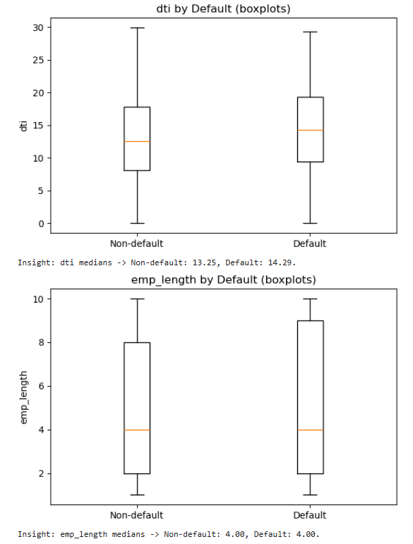

# 💳 LendingClub Loan Default Prediction

## 📘 Introduction
This project focuses on predicting the likelihood of loan default using LendingClub data. By analyzing borrower profiles, loan attributes, and financial indicators, the goal is to help financial institutions assess credit risk more effectively.  
The project demonstrates an end-to-end machine learning workflow — from data exploration and cleaning to model training and evaluation.

---

## 🎯 Objectives
- Predict the probability of a borrower defaulting on a loan.  
- Identify key factors influencing loan repayment behavior.  
- Build an interpretable model to assist in credit risk assessment.

---

## 🧠 Key Methods
- **Exploratory Data Analysis (EDA):** Conducted univariate and bivariate analysis to identify key trends.  
- **Feature Engineering:** Managed missing values, encoded categorical variables, and derived impactful features.  
- **Modeling:** Implemented Logistic Regression, Random Forest, and Gradient Boosting models.  
- **Evaluation Metrics:** Compared models using Accuracy, ROC-AUC, Precision-Recall, and Confusion Matrix.

---

## 📊 Visualizations

### 🔹 Bivariate Analysis

#### Bivariate Analysis 1  
  

#### Bivariate Analysis 2  
  

#### Bivariate Analysis 3  
  

#### Bivariate Analysis 4  
  

---

### 🔹 Model Comparison
  
*Comparison of model performance before and after hyperparameter tuning.*

---

### 🔹 Feature Importance
  
*Top features contributing most to loan default prediction.*


## 🔍 Key Insights & Outcomes

### 1. Class Imbalance
- Only ~14–15% of loans default; most are fully paid.  
- **Accuracy alone is misleading** because models predicting mostly non-defaults appear accurate but fail to capture high-risk loans.

### 2. Model Performance Summary

**Tuned Logistic Regression** (Primary Model)  
- Accuracy: 0.6388 | Precision: 0.2245 | Recall: 0.6311 | F1-score: 0.3312 | ROC-AUC: 0.6896  
- Most effective for identifying high-risk loans while remaining interpretable.

**Decision Tree**  
- Base: Accuracy = 0.7673, Recall = 0.1940 → biased toward majority class  
- Tuned: Accuracy = 0.5828, Recall = 0.6617 → better minority class detection but lower overall accuracy  
- Shows the trade-off between accuracy and minority class detection.

**Random Forest**  
- Base: Accuracy = 0.8584, Recall = 0.0014, Precision = 0.6667 → fails to detect defaulters due to class imbalance  
- Tuned: Accuracy = 0.6341, Recall = 0.6219, F1-score = 0.3251, ROC-AUC = 0.6828 → balances detection and accuracy  
- Highlights importance of hyperparameter tuning and class balancing.

### 3. Key Drivers of Loan Default
- **Higher interest rates** and **lower annual incomes** increase default risk.  
- **Loan grade**, **loan purpose**, and **debt-to-income ratio** are strong predictors of repayment behavior.

### 4. Practical Recommendations
- **Primary Model:** Tuned Logistic Regression — robust, interpretable, and captures most defaulters.  
- **Secondary Check:** Tuned Random Forest — useful to cross-verify predictions.  
- **Decision Tree:** Use only if carefully tuned; otherwise, biased toward the majority class.  
- **Focus:** Optimize for **Recall** and **F1-score** on defaults rather than raw Accuracy due to class imbalance.

---

## 🛠️ Technologies Used
- **Languages:** Python  
- **Libraries:** pandas, numpy, matplotlib, seaborn, scikit-learn, imbalanced-learn  
- **Environment:** Jupyter Notebook  

---

## ⚙️ Setup & Installation
**1. Clone the repository:**
   ```bash
   git clone https://github.com/yourusername/LendingClub-Loan-Default-Prediction.git
   cd LendingClub-Loan-Default-Prediction
   ```
**2. Install dependencies:**
   ```
   pip install -r requirements.txt
   ```
**3. Open the notebook:**
   ```
   jupyter notebook "LendingClub Loan Default Prediction.ipynb"
   ```
---

## ▶️ Usage Instructions

- Run all cells sequentially to execute the workflow — from data cleaning to model evaluation.
- Modify hyperparameters or feature sets to experiment with different model performances.
- Review visual outputs and metrics to interpret the predictive results.

---

## 🔗 Connect with Me

Let’s connect on LinkedIn for project discussions or data-driven collaborations:

[](https://www.linkedin.com/in/indu-r-3a3767170/)

---

## 🙌 Feedback & Support

If you found this project helpful, please ⭐ star the repository and share your thoughts. Suggestions and contributions are always welcome!
